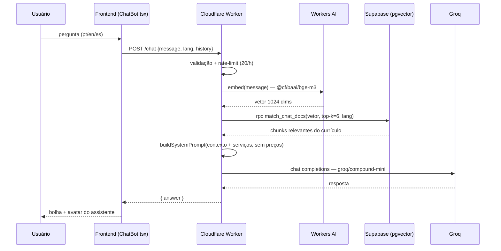
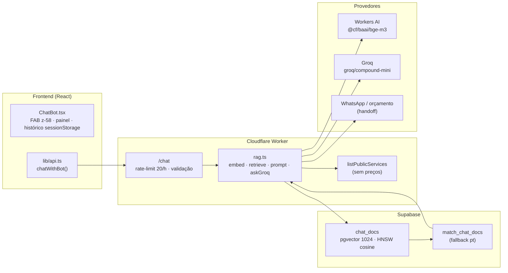

<div align="center">


# Portfolio Cavalcante

**Data Analyst & AI Specialist**

[](https://react.dev)
[](https://www.typescriptlang.org)
[](https://tailwindcss.com)
[](https://vitejs.dev)
[](https://typegpu.com)
[](https://motion.dev)
[](https://github.com/pmndrs/zustand)
[](https://www.i18next.com)
[](https://www.python.org)
[](https://playwright.dev)
[](https://github.com/features/actions)
[](https://pages.github.com)

Meu portfólio pessoal — projetos, experimentos e um pouco do que sei fazer com dados, IA e código.

[Ver ao vivo →](https://cavalcanteprofissional.github.io/portfolio-cavalcante/)

</div>

---

## Funcionalidades

| Feature | Descrição |
|---------|-----------|
| **BootScreen BIOS** | Tela cheia com efeito CRT (scanlines, vignette, flicker, glow), digitação rápida com `[OK]` animado, beep de POST + chime de boas-vindas |
| **ProfileLight 3D** | Foto de perfil com iluminação relight em tempo real via WebGPU — luz neon azul/ciano/roxo que segue o mouse ou orbita automaticamente |
| **CookieConsent** | Modal estilo BIOS com duas etapas (consent + política de privacidade), typing animation, click-outside para fechar |
| **Revelação em foco** | Transição coordenada ao fim do boot: fundo fade + blur, glow assenta, Nav desliza, Hero sobe com escala |
| **Dark/Light mode** | Detecção automática do sistema + toggle manual |
| **3 idiomas** | Português, English, Español (i18next) |
| **Nav com scroll ativo** | Destaca a seção atual durante a navegação |
| **Cards de projeto** | Demo, código e status (🟢 concluído / 🟡 em andamento) com badges de progresso |
| **TechStack real** | Baseado nos projetos do GitHub, agrupado em 6 categorias |
| **Currículo automático** | Pipeline Python gera PDFs em PT/EN/ES via mBART-large-50 + Playwright |
| **Chatbot IA (RAG)** | Widget estilo WhatsApp respondendo do currículo via pgvector + Groq (veja [Chatbot IA (RAG)](#chatbot-ia-rag)) |
| **FAQ estruturada** | Dados JSON-LD para rich results no Google |
| **Acessibilidade** | Skip-to-content, reduced-motion, aria-labels |
| **Performance** | Lazy loading, code splitting, WebP otimizado |
| **QR Code** | Acesso mobile rápido |

## Stack

| Camada | Tecnologias |
|--------|-------------|
| **Frontend** | React 19 + TypeScript + Tailwind CSS |
| **Build** | Vite 7 + unplugin-typegpu |
| **GPU** | TypeGPU (WebGPU compute + render) + ML depth estimation |
| **Animação** | Motion (motion.dev) |
| **Estado** | Zustand |
| **i18n** | i18next + react-i18next |
| **Ícones** | Lucide React + React Icons |
| **Backend** | Cloudflare Worker (TypeScript) + Supabase (Postgres + Auth) |
| **IA (RAG)** | Cloudflare Workers AI (`@cf/baai/bge-m3`) · Supabase pgvector (HNSW) · Groq (`groq/compound-mini`) |
| **Email/PDF** | Brevo + pdf-lib |
| **Analytics** | Umami (consent-gated) |
| **Currículo** | Python + mBART-large-50 + Jinja2 + Playwright |
| **Teste** | Playwright (E2E) |
| **Deploy** | GitHub Actions + GitHub Pages (site) · Wrangler (Worker) |

## Rodar local

```bash
npm install        # instalar dependências
npm run dev        # servidor de desenvolvimento (http://localhost:5173)
npm run build      # build de produção
npm run preview    # preview do build
```

### Qualidade

```bash
npm run typecheck  # checagem de tipos (tsc --noEmit)
npm run lint       # lint (ESLint flat config)
npm run test       # testes E2E (Playwright)
```

### Gerar currículos (PDF)

```bash
pip install transformers torch sentencepiece sacremoses jinja2 python-frontmatter pyyaml playwright
playwright install chromium
python resume/build.py
```

Crie um `.env.local` na raiz com seu token do Hugging Face (opcional — acelera downloads):

```
HF_TOKEN=hf_seu_token_aqui
```

Os PDFs são gerados em `public/cv/` e versionados no repo. Edite `resume/curriculo-fonte.md` para atualizar — a pipeline traduz e renderiza em PT/EN/ES automaticamente.

## Backend real (orçamentos / admin)

O site tem um backend gratuito para o fluxo de orçamento: **Supabase** (banco + auth), **Cloudflare Worker** (API/PDF/email) e **Brevo** (disparo de email). O admin é uma página separada em `admin.html` (também acessível como `/admin`); o antigo `#/admin` redireciona automaticamente.

### Variáveis do frontend (`.env`)

```bash
VITE_SUPABASE_URL=          # pública (anon key)
VITE_SUPABASE_ANON_KEY=     # pública (sb_publishable_...)
VITE_UMAMI_WEBSITE_ID=      # pública — analytics
VITE_UMAMI_SRC=             # pública — https://cloud.umami.is/script.js
VITE_WORKER_URL=            # pública — URL do Cloudflare Worker
```

### Worker (pasta `worker/`)

```bash
cd worker
npm install
npx wrangler login
npx wrangler secret put BREVO_API_KEY       # secreto — nunca no repo
npx wrangler secret put SERVICE_ROLE_KEY   # service_role NOVA (rotacionada) — nunca no repo
npx wrangler secret put SUPABASE_URL       # chave pública (pode ser variável vars)
npx wrangler dev        # teste local
npx wrangler deploy     # deploy
```

> ⚠️ **Segurança:** credenciais secretas só entram via `wrangler secret put`, nunca no chat nem no bundle. O `service_role` antigo (postado em chat) foi tratado como comprometido e deve ser rotacionado.

O schema do banco fica em `supabase/schema.sql` (RLS restritivo: `services` é leitura pública; `orcamentos` só o Worker acessa via `service_role`).

## Chatbot IA (RAG)

O site tem um assistente virtual estilo **WhatsApp** (FAB no canto inferior direito) que
responde dúvidas sobre o currículo usando **RAG** (*Retrieval-Augmented Generation*): a
pergunta é convertida em **embedding**, os trechos mais relevantes do currículo são buscados
por **similaridade vetorial** (pgvector) e a resposta é gerada pela **Groq** usando
exclusivamente esse contexto.

### Fluxo (sequência)



### Arquitetura



### Conhecimento (chunks)

As informações vêm de **7 fontes** (`scripts/ingest.mjs`, Onda 1.24): `curriculo`
(`resume/curriculo-fonte.md`) · `cv-pdf` (`resume/cv_br_lucas_cavalcante.pdf` via `pdf-parse`) ·
`content` (`CONTENT.md`: meta/stats/empresas/disponibilidade) · `faq` · `projetos` · `servicos` ·
`experiencias` — em **pt/en/es** (≈159 chunks). A migração `20260908_chat_docs.sql` cria a tabela
`chat_docs` (pgvector 1024 + HNSW cosine) e a `20260911_chat_docs_source.sql` adiciona a coluna
`source` + fallback de idioma: **prioriza `lang`, completando com `pt` só se faltar**. A ingestão
gera chunks, embeddings via REST do Workers AI (`@cf/baai/bge-m3`) e faz **delete-then-insert
por fonte** (idempotente):

```bash
node scripts/ingest.mjs --list  # pré-visualiza fontes/chunks sem persistir
npm run ingest                  # curriculo + cv-pdf + content + faq + projetos + servicos + experiencias
```

Requer `SERVICE_ROLE_KEY`, `CLOUDFLARE_ACCOUNT_ID` e `CLOUDFLARE_API_TOKEN` no `.env.local`
(o token Cloudflare precisa da permissão **Workers AI:Edit**) e a migração `20260911_chat_docs_source.sql`
aplicada no SQL Editor do Supabase.

### Limites atuais & segurança

- **Rate limit**: 20 mensagens/h por IP (`Retry-After` no 429) — orçamento free-tier.
- **Guardrails (Onda 1.24)**: `MIN_SCORE` 0.30 descarta chunks irrelevantes; **prompt injection**
  e **conteúdo sensível** são bloqueados antes do RAG (resposta neutra + `logViolation` estruturado);
  system prompt blindado (pt/en/es) e `validateAnswer` pós-geração.
- **Contexto restrito**: o sistema de prompt manda responder só com o contexto + serviços
  públicos; **não inventa preços** e faz handoff para WhatsApp/orçamento.
- **Sem chave Groq**: responde 503 amigável (o front cai no fallback demo).
- **Secrets**: `GROQ_API_KEY` e `SERVICE_ROLE_KEY` só no Worker (`wrangler secret put`);
  `chat_docs` `match_chat_docs` liberadas p/ anon via grant público (sem RLS — leitura de
  chunks não é sensível, embedding fica no servidor).

## Arquitetura

```
portfolio/
├── src/
│   ├── components/     # BootScreen, ProfileLight, CookieConsent, Hero, QuoteModal…
│   ├── i18n/           # traduções pt/en/es (i18next)
│   ├── stores/         # Zustand (boot, theme, consent)
│   ├── lib/typegpu/    # WebGPU renderer, shaders WGSL, ML inference, light control
│   ├── lib/            # api.ts (worker), pricing.ts, supabase.ts
│   ├── pages/          # Admin.tsx (página própria — admin.html + /admin)
│   ├── admin/          # main.tsx do admin (MPA separado do bundle do site)
│   ├── data/           # projects.json, services.ts (catálogo público)
│   └── index.css       # Tailwind + efeitos CRT/glow/neon
├── public/
│   ├── images/         # thumbnail, og, companies
│   ├── icons/          # logo-512.png + derivados
│   ├── cv/             # PDFs versionados
│   └── robots.txt · sitemap.xml · site.webmanifest
├── branding/           # fonte .ai da marca (só *.ai versionado)
├── scripts/            # generate-icons.mjs (npm run icons)
├── resume/             # pipeline de currículos (Python + mBART)
├── supabase/           # schema.sql (tabelas + RLS)
├── worker/             # Cloudflare Worker (API, PDF, Brevo)
└── e2e/                # Playwright E2E tests
```

## Referências

| Arquivo | Descrição |
|---------|-----------|
| [CHANGELOG.md](CHANGELOG.md) | Histórico completo de versões (semver), desde v1.0.0 até a versão atual — inclui listas de tarefas, melhorias e correções por release |
| [LICENSE](LICENSE) | Licença MIT — Copyright (c) 2026 Lucas Cavalcante |
| [CONTENT.md](CONTENT.md) | Guia de conteúdo para manutenção do site (textos, imagens, dados de projetos e experiências) |
| [TODO.md](TODO.md) | Roadmap de melhorias planejadas, backlog de features e notas de arquitetura |

---

Feito com React 19, TypeGPU e muito café. :wave:
